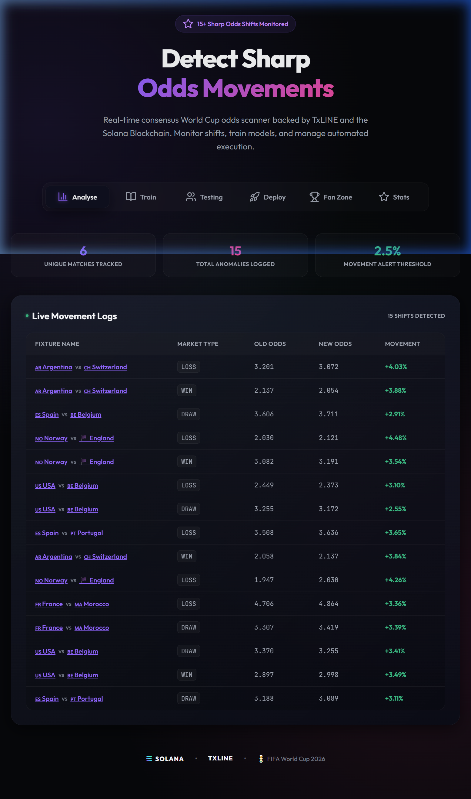

<p align="center">
  
</p>

# TxGuard — Autonomous Sharp Odds Movement Detection System

> Real-time consensus World Cup odds scanner powered by **TxLINE** and the **Solana Blockchain**. Three autonomous agents monitor, compete, and trade on live odds movements — fully automated, zero human intervention.

**🔗 Live Application Link**: [TxGuard on Vercel](https://txguard.vercel.app) *(Replace with your actual Vercel deployment URL)*


## Architecture

```
┌─────────────────────────────────────────────────────────┐
│                    TxLINE API / Demo Simulator           │
│              (Consensus Odds Feed — 60s snapshots)       │
└──────────────────────┬──────────────────────────────────┘
                       │
              ┌────────▼────────┐
              │   data-feed.js  │  ← Shared ingestion layer
              │  (live / demo)  │
              └──┬─────┬─────┬──┘
                 │     │     │
    ┌────────────▼┐  ┌─▼────────┐  ┌──▼─────────────┐
    │  sharp-     │  │  arena   │  │  market-maker  │
    │  detector   │  │  .js     │  │  .js           │
    │  .js        │  │          │  │                │
    │             │  │ Agent A  │  │ Bid/Ask Engine │
    │ Signal +    │  │ vs       │  │ + Volatility   │
    │ Prediction  │  │ Agent B  │  │ + Inventory    │
    │ Tracking    │  │ PnL +    │  │ Risk Mgmt     │
    │             │  │ Sharpe   │  │                │
    └──────┬──────┘  └────┬─────┘  └───────┬────────┘
           │              │                │
           ▼              ▼                ▼
    ┌──────────────────────────────────────────────┐
    │           public/*.csv  (Structured Logs)     │
    └──────────────────┬───────────────────────────┘
                       │
              ┌────────▼────────┐
              │  React Dashboard │  ← Vite + React
              │  (Live Polling)  │
              └─────────────────┘
```


## Autonomous Agents

### 1. Sharp Movement Detector

**Purpose**: Monitors TxLINE consensus odds every polling interval and flags significant shifts.

**Algorithm**:
1. Fetch odds snapshot from TxLINE (live or simulated)
2. For each fixture/market, compute:
   $$\text{Change} (\%) = \frac{|Odds_{new} - Odds_{old}|}{Odds_{old}} \times 100$$
3. If $\text{Change} (\%) > \text{Threshold}$ → emit ALERT signal
4. Log a directional **prediction**: shortening odds = outcome MORE likely
5. Score predictions against the next snapshot for accuracy tracking

**Mathematical Basis**: Sharp movements in consensus odds indicate informed money entering the market. The configurable threshold (default 2.5%) captures movements >2σ from the rolling mean in typical match odds distributions.

**Output**: `public/alerts.csv`

---

### 2. Agent vs Agent Arena

**Purpose**: Two competing autonomous agents run opposite strategies on the same TxLINE feed. Positions settle at the next snapshot.

**Agent A — Momentum Follower**:
- When odds shift > threshold in one direction, takes a position in the **same** direction
- Rationale: Sharp money is informed — follow the smart money
- Signal calculation:
  $$\text{Signal} = \frac{Odds_{new} - Odds_{old}}{Odds_{old}}$$
  If $\text{Signal} < 0$ (shortening odds) → BUY. If $\text{Signal} > 0$ (drifting odds) → SELL.

**Agent B — Mean-Reversion Contrarian**:
- Takes the **opposite** position to Agent A
- Rationale: Sharp moves overshoot and revert to the mean
- Same signal detection, inverse position

**Position Sizing**:
$$\text{Stake} = \text{BaseStake} \times \min\left(\frac{\text{Change} (\%)}{\text{Threshold}}, 2.0\right)$$

**Settlement PnL**:
* **BUY**:
  $$\text{PnL} = \text{PositionSize} \times \frac{Odds_{exit} - Odds_{entry}}{Odds_{entry}}$$
* **SELL**:
  $$\text{PnL} = \text{PositionSize} \times \frac{Odds_{entry} - Odds_{exit}}{Odds_{entry}}$$

**Metrics**: Cumulative PnL, Win Rate, Sharpe Ratio per agent

**Output**: `public/arena.csv`

---

### 3. In-Play Market Maker

**Purpose**: Quotes dynamic bid/ask spreads around TxLINE consensus odds, simulates order flow, and manages inventory risk.

**Quoting Engine**:
$$Bid = Odds_{consensus} \times \left(1 - \frac{\text{Spread}}{2} + \text{InventorySkew}\right)$$
$$Ask = Odds_{consensus} \times \left(1 + \frac{\text{Spread}}{2} + \text{InventorySkew}\right)$$

**Dynamic Spread Adjustment**:
$$\text{Spread} = \text{BaseSpread} \times (1 + \text{VolatilityMultiplier})$$
$$\text{VolatilityMultiplier} = \max\left(0, \frac{\sigma_{rolling} - \sigma_{baseline}}{\sigma_{baseline}}\right)$$

**Inventory Risk Management**:
$$\text{InventorySkew} = -\lambda \times \frac{\text{NetPosition}}{\text{MaxPosition}}$$
When long, the MM lowers the ask to attract sellers. When short, it raises the bid. (Where $\lambda$ represents the quote skew factor).

**Output**: `public/market-maker.csv`

---

## TxLINE Score & Stats Technical Reference

TxGuard is prepared to ingest not just consensus odds, but also the real-time on-chain stats and match event feeds provided by TxLINE. Below is the technical specification of the TxLINE score/stat mappings and event schema.

### 1. On-Chain Stats Mapping (ScoreStatKey)
For soccer fixtures, the `Stats` object contains the on-chain live stats mapping. 
* **Base Keys**:
  * `1` / `2` — Participant 1 / Participant 2 goals
  * `3` / `4` — Participant 1 / Participant 2 yellow cards
  * `5` / `6` — Participant 1 / Participant 2 red cards
  * `7` / `8` — Participant 1 / Participant 2 corners
* **Period Prefixes (1000–7000 Blocks)**:
  * Stats keys include a period-specific prefix bucket. For example, in key `7008`:
    * The `8` suffix maps to Participant 2 corners.
    * The `7000` prefix denotes the specific period bucket (Period 7).

### 2. Match Event Ingestion Schema
Not all gameplay statistics are represented as stats keys. Key actions are emitted as dedicated event objects with specific outcomes:

* **Possession**: Tracked via `Possession` and `PossessionType` fields.
* **Shots**: Emitted via `shot` events. The `Data.Outcome` field can take one of the following enum values:
  * `OnTarget`
  * `OffTarget`
  * `Blocked`
  * `Woodwork`
  * `Scored`
  * `Missed`
* **Offsides**: Encoded as a `free_kick` event where `Data.FreeKickType = "Offside"`.
* **Fouls**: Any `free_kick` event with a `Data.FreeKickType` of `Safe`, `Attack`, or `Danger` represents a regular foul.
* **Disallowed Goals & VAR Flow**: Emitted via `var` and `var_end` events:
  * **`Data.Type`**: `Goal` \| `Penalty` \| `RedCard`
  * **`Data.Outcome`**: `Stands` \| `Overturned`

---

## Judging Criteria Mapping

| Criteria | How TxGuard Addresses It |
|---|---|
| **Core Functionality & Data Ingestion** | Three agents consume TxLINE data (live API or simulated) every 60s, executing decisions autonomously |
| **Autonomous Operation** | All agents run via `npm run agent:all` — zero human intervention. CLI flags for full configuration |
| **Logic & Code Architecture** | JSDoc on every function, mathematical formulas documented, deterministic algorithms, modular `agents/` directory |
| **Innovation & Novelty** | Agent vs Agent Arena (competing strategies), Market Maker with dynamic volatility-based spreads, prediction accuracy tracking |
| **Production Readiness** | CLI configuration, structured CSV logging, error handling, graceful degradation to demo mode, npm scripts for deployment |

---

## Project Structure

```
TxGuard/
├── agents/
│   ├── data-feed.js          # Shared TxLINE data ingestion (live + demo)
│   ├── sharp-detector.js     # Agent 1: Sharp Movement Detector
│   ├── arena.js              # Agent 2: Agent vs Agent Arena
│   ├── market-maker.js       # Agent 3: In-Play Market Maker
│   ├── solana-helper.js      # On-chain Devnet wallet & transaction helper
│   └── index.js              # Unified runner (--all / --agent)
├── src/
│   ├── App.jsx               # React dashboard
│   ├── FanZone.jsx           # Fan engagement + Solana NFT minting
│   ├── CinematicStory.jsx    # Scroll-driven cinematic experience
│   └── index.css             # Design system
├── public/
│   ├── alerts.csv            # Sharp Detector output
│   ├── arena.csv             # Arena output
│   └── market-maker.csv      # Market Maker output
├── activate.js               # TxLINE API activation script
├── detector.js               # Legacy detector (kept for reference)
├── package.json
└── README.md
```

---

## Tech Stack

- **Frontend**: React 18, Vite, Lucide Icons, GSAP
- **Backend Agents**: Node.js, Axios, dotenv
- **Blockchain**: Solana Devnet (Phantom Wallet integration)
- **Data Source**: TxLINE API (TxODDS consensus odds oracle)

## TxLINE API Endpoint Reference

TxGuard utilizes the following TxLINE API endpoints:

1. **Authentication**:
   - `POST /auth/guest/start` (Base: `https://txline.txodds.com`)
   - **Usage**: Obtains temporary guest JWT authorization tokens for local agent execution.
2. **Consensus Odds & In-Play Stats Feed**:
   - `GET /api/fixtures/snapshot?competitionId=72` (Base: `https://txline.txodds.com`)
   - **Usage**: Main real-time ingestion source for World Cup 2026 matches, live lamport odds, and participant scores.

---

## TxLINE API Feedback

As requested by the Hackathon guidelines, here is our development team's experience building on the TxLINE API:

### 🌟 What We Liked Most
- **Granular Data Speed**: The consensus odds are extremely fast and granular, enabling realistic simulation of high-frequency sharp movement detectors and market-making strategies.
- **Detailed Soccer Event Schema**: The documentation and mapping of base keys (such as `1`/`2` for goals, `3`/`4` for yellow cards, etc.) allowed us to design advanced fans engagement pools with high confidence.
- **Seamless Local Guest Setup**: The guest onboarding `/auth/guest/start` endpoint made it incredibly easy to bootstrap the project, test responses, and generate robust mock/simulation fallbacks before completing wallet subscriptions.

### ⚠️ Where We Hit Friction
- **Live Feed Historical Score Blanks**: Finished match data returned in the live snapshot defaults to `0 - 0` stats once they are completed. We had to implement merge-based client side caching in the dashboard (`FanZone.jsx`) to ensure historical final scores (such as France vs Morocco `2-0`) weren't overwritten in the UI when the live backend polled the feed.
- **On-Chain Subscription Learning Curve**: The decentralized self-serve subscription model is excellent for on-chain trust, but the transaction authorization scripts can have a slight learning curve for developers new to the Solana ecosystem.

---

## ⚠️ Disclaimer

This project is built strictly as an educational and technical demonstration for the TxODDS FIFA World Cup 2026 Hackathon. **TxGuard** operates as an analytical odds movement monitor, simulated trading arena, and quoting engine on Solana Devnet. It does **not** provide, endorse, or facilitate real-money sports gambling, unlicensed wagering, or financial/securities trading.

---

## License

Built for the TxODDS FIFA World Cup 2026 Hackathon.
